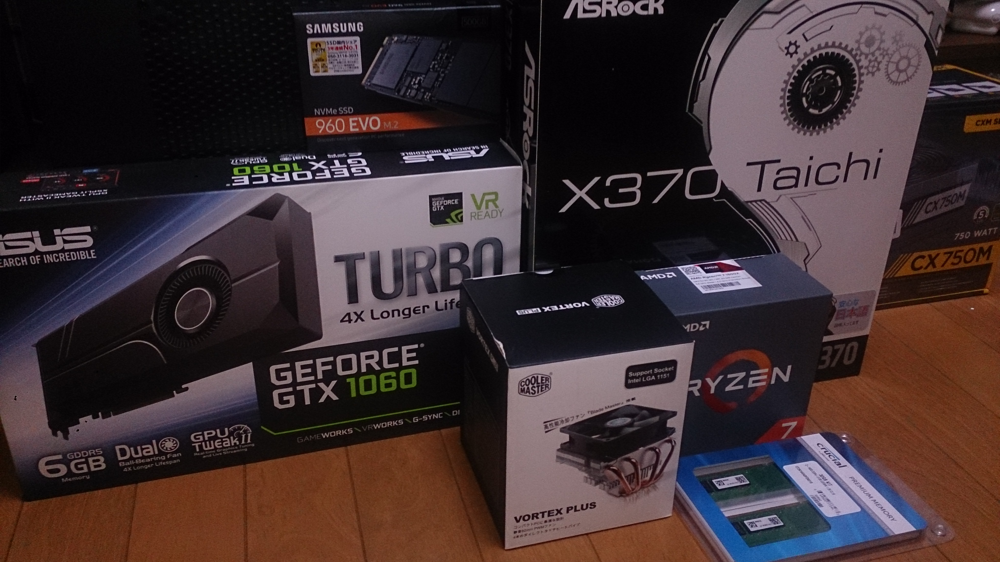
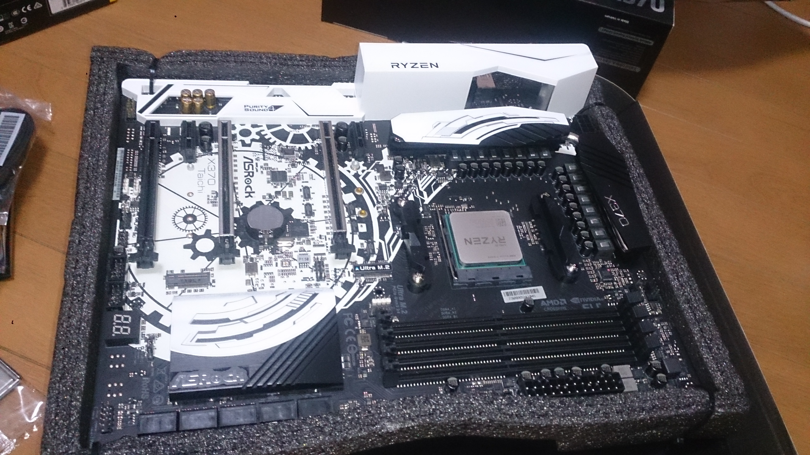
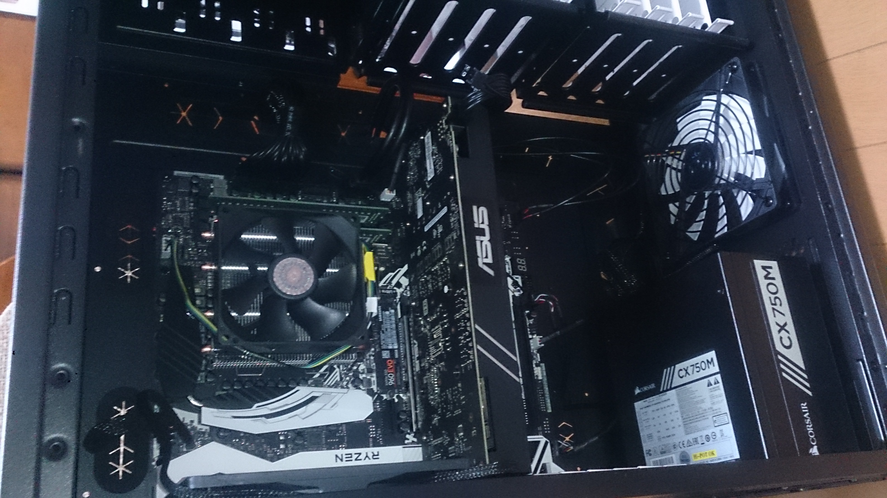

RyzenでPCを組んだので紹介。  
このページに特に役に立つ情報はありません。  
スマホで撮った画像なので汚いのはご愛敬。  

  
  
Ryzenロゴがかっこいい。  
  
最近のグラボはでかすぎだと思う。  

## スペック

|パーツ|製品|
|:-----|:---|
|CPU|AMD Ryzen 1800X|
|CPUクーラー|Cooler Master Vortex Plus|
|マザーボード|ASRock X370 Taichi|
|RAM|Crucialの安いやつ 16GB x2|
|GPU|ASUS GeForce GTX1060 TURBO-GTX1060-6G|
|SSD|Samsung SSD 500GB 960 EVO M.2|
|電源|CORSAIR CX750M|
|ケース|Fractal Design Define XL R2|

## 所感

* Ryzenはかっこいい。
* AMDのCPUクーラーを使うのは初めてだったので苦労した。モデルはRyzen対応の奴から安いのを選んだだけ。
* メモリースロットは最近流行り?の爪が片側にしかないタイプ。きちんと刺さっていなかったらしく、最初は起動しなかった。
* その際、起動しない原因を数字で示してくれるDr.Debugはなかなか便利だった。
* グラボは値段優先。でもTensorflowに使うためメモリは6GBのモデルにした。
* EVOのほうがPROより上のクラスだと思ってた。
* とはいえ今まで容量優先でHDDを使っていたので、NVMeのM.2 SSDは爆速に感じる。
* M.2はOSのインストールに問題があるという記事をいくつか見たが、自分の環境では特に設定を変えなくてもBIOSから認識されたし、ドライバーなしでOSのインストールまでできた。
* 電源は適当。ネットには容量厨が多いけれど、実際のところそんなに使い切らないはず。
* Fractal Designは割と事前評判がよかったので使ってみたが、パーツのかみ合わせが意外と悪くて苦労した。裏配線はやりやすい。あとフルタワーなので重い。貧弱なプログラマーだと筋肉痛になるぐらい(笑)。
* 間違えてWin10 Homeを買っていた。リモートデスクトップとHyper-Vが動かないのは致命的なので、泣く泣くアップグレード。
* <s>なぜかUSBがスマホ(ZenFone2)を認識しない。そのほかのデバイスは認識するので相性か。USB周りはほかでもトラブルが起こっているらしいので、BIOSアップデート待ち。</s>
    **訂正** ZenFoneがいかれていただけでした。ごめんなさい。
