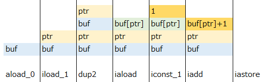
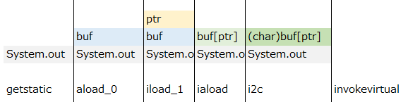

BrainfuckソースコードをJavaバイトコードにコンパイルするプログラムを作ってみたのでメモ。  
詳細なJavaバイトコードの解説は行いません。

[リポジトリ](https://bitbucket.org/minebreaker_tf/brainfuck)

[The Java Virtual Machine Specification](https://docs.oracle.com/javase/specs/jvms/se8/html/index.html)  
クラスファイルについては4章、命令セットについては6章を参照されたし。

## Brainfuck?

[Wikipedia](https://ja.wikipedia.org/wiki/Brainfuck)

命令がわずか8つしかないチューリング完全なプログラミング言語。実用性はないが面白い。  
大雑把に説明すると、Brainfuck実行環境はbyteの配列とその要素を指すポインタを持ち、それを命令セットで操作していく感じ。
詳細はリンク先を参照のこと。


## 準備

byte配列をちまちま作るのはやっていられないので、まず、Byteを書き込むためのコンビニエンスメソッドを定義する。

```java
/**
 * Helper class to create byte array fluently.
 */
public final class FluentByteWriter {

    private final OutputStream os;

    public FluentByteWriter(OutputStream os) {
        this.os = os;
    }

    public FluentByteWriter write(Object... bytes) {

        try {
            for (Object o : bytes) {
                // パターンマッチできないクソ言語があるらしい
                if (o instanceof Integer) {
                    os.write((Integer) o);  // Note high-order bits are ignored
                } else if (o instanceof Byte) {
                    os.write((Byte) o);
                } else if (o instanceof byte[]) {
                    os.write((byte[]) o);
                } else if (o instanceof String) {
                    os.write(((String) o).getBytes(StandardCharsets.UTF_8));
                } else {
                    throw new UnsupportedOperationException("Unwritable class: " + o.getClass().getCanonicalName());
                }
            }
        } catch (IOException e) {
            throw new UncheckedIOException(e);
        }

        return this;
    }

}
```

可変長引数でObjectを受け取って、その方に応じてOutputStreamに書き込んでいく。  
`OutputStream.write(int)`は、引数のintの上位24ビットを無視して書き込む(Javaのintは4バイト)。
これがないと、Javaの16進リテラルは符号付のため、最上位の1ビットが有効な値を書き込めなくなってしまう
(例えば`0xCA`を書き込もうとしたとき、byteではなくintになってしまう)。

次に、intを4バイト/2バイトに変換して書き込むヘルパーを定義。これも上位ビットは無視。
```java
public static byte[] toByteArray4(int n) {
    return ByteBuffer.allocate(4).putInt(n).array();
}
public static byte[] toByteArray2(int n) {
    return toByteArray2((short) n);
}
```

4バイト版だけならGuavaに[Ints.toByteArray()](http://google.github.io/guava/releases/snapshot-jre/api/docs/com/google/common/primitives/Ints.html#toByteArray-int-)
があるが、2バイト版も必要なので独自定義。  
(今思うと`Shorts.toByteArray()`でよかった気もする...)


## コンパイル

出力されるバイトコードの仕様は以下の通り。

* デフォルトパッケージの`Main`クラス
* `public static void main(String[] args)`メソッドを持つので、`java`コマンドで実行可能
* Brainfuckソースコードは、mainメソッドの中身にコンパイルされる

### 準備

```java
0xCA, 0xFE, 0xBA, 0xBE, // CAFEBABE
0x00, 0x00,  // miner version: 0
0x00, 0x31,  // major version: 49  // Version 49 doesn't require stack map
0x00, 0x20,  // constant pool count: 31 + 1
// constant pool
0x07, 0x00, 0x02,  // 1. class: Main
0x01, 0x00, 0x04,  // 2. utf8
"Main",
0x07, 0x00, 0x04,  // 3. class: java/lang/Object
0x01, 0x00, 0x10,  // 4. utf8
"java/lang/Object",
// System.out.print
0x09, 0x00, 0x06, 0x00, 0x08,  // 5. fieldref System.out
0x07, 0x00, 0x07,  // 6. class
0x01, 0x00, 0x10,  // 7. utf8
"java/lang/System",
0x0C, 0x00, 0x09, 0x00, 0x0A,  // 8. name and type
0x01, 0x00, 0x03,  // 9. utf8
"out",
0x01, 0x00, 0x15,  // 10. utf8
"Ljava/io/PrintStream;",
0x0A, 0x00, 0x0C, 0x00, 0x0E,  // 11. method PrintStream.print(int)
0x07, 0x00, 0x0D,  // 12. class
0x01, 0x00, 0x13,  // 13. utf8
"java/io/PrintStream",
0x0C, 0x00, 0x0F, 0x00, 0x10,  // 14. name and type
0x01, 0x00, 0x05,  // 15. utf8
"print",
0x01, 0x00, 0x04,  // 16. utf8
"(C)V",
// System.in.read(int)
0x09, 0x00, 0x06, 0x00, 0x12,  // 17. fieldref System.in
0x0C, 0x00, 0x13, 0x00, 0x14,  // 18. name and type
0x01, 0x00, 0x02,  // 19. utf8
"in",
0x01, 0x00, 0x15,  // 20. utf8
"Ljava/io/InputStream;",
0x0A, 0x00, 0x16, 0x00, 0x18,  // 21. method InputStream.read(int)
0x07, 0x00, 0x17,  // 22. class
0x01, 0x00, 0x13,  // 23. utf8
"java/io/InputStream",
0x0C, 0x00, 0x19, 0x00, 0x1A,  // 24. name and type
0x01, 0x00, 0x04,  // 25. utf8
"read",
0x01, 0x00, 0x3,  // 26. utf8
"()I",
// main
0x01, 0x00, 0x04,  // 27. utf8
"main",
0x01, 0x00, 0x16,  // 28. utf8
"([Ljava/lang/String;)V",
0x01, 0x00, 0x04,  // 29. utf8
"args",
0x01, 0x00, 0x13,  // 30. utf8
"[Ljava/lang/String;",
// "Code" for Attribute
0x01, 0x00, 0x04,  // 31. utf8
"Code",
0x00, 0x21,  // access_flags: ACC_SUPER ACC_PUBLIC
0x00, 0x01,  // this class
0x00, 0x03,  // super class
0x00, 0x00,  // interfaces count
// interfaces[]
//NOP
0x00, 0x00,  // fields count
// fields[]
// NOP
0x00, 0x01,  // method count
```

特筆すべきことはなし。  
インスタンス化する必要がないので`<init>`は持たない。  
バイトコードのバージョンが49なのは、50からスタックマップが必要になって面倒なため。

```java
        // methods[]
        // main
        0x00, 0x09,  // access flags: ACC_PUBLIC ACC_STATIC
        0x00, 0x1B,  // name index: main
        0x00, 0x1C,  // descriptor index
        0x00, 0x01,  // attributes count
        // attribute info
        0x00, 0x1F  // attribute name index: Code
);
byte[] code = compileCodes(is);
w.write(
        ByteUtils.toByteArray4(code.length + 12),  // attribute length
        // info
        0x00, 0x04,  // max stack
        0x00, 0x02,  // max locals
        // code length
        ByteUtils.toByteArray4(code.length),
        // code
        code,
        0x00, 0x00,  // exception table length
        // exception table
        // NOP
        0x00, 0x00,  // attribute count
        // attribute info[]
        // NOP
        // class attributes count
        0x00, 0x00
        // attributes
        // NOP
```

`compileCodes()`メソッドが、実際のBrainfuck-Javaバイトコード変換を行っている。

### Brainfuck-Javaバイトコード変換

まず環境を準備する。
```
w.write(
        // creates data buffer
        0x11, 0x75, 0x30,  // sipush 30000
        0xBC, 0x0A,        // newarray int
        0x4B,              // astore_0  // ignore application arguments (String[] args)
        // creates instruction pointer
        0x03,              // iconst_0
        0x3C               // istore_1
);
w.write(
        compileCodeElements(is),
        0xB1  // return
);
```

最初にバッファーを作る。
```
sipush 30000
newarray int
astore_0
```
何を間違えたのかbyteではなくintの配列を作っていた。気にしない気にしない……。

続いてインストラクションポインターを作る。
```
iconst_0
istore_1
```

#### compileCodeElements()

いよいよ実際のコード変換。
```
while ((i = is.read()) >= 0) {
    switch (i) {
    case ('+'):
        // ...
        break;
    case ('-'):
        // ...
        break;
    /*
     * ....
```
レクサーもパーサーもいらないので楽。直接ストリームから一文字読み込み、switchで分岐していく。

##### +
```
0x2A,  // aload_0
0x1B,  // iload_1
0x5C,  // dup2
0x2E,  // iaload
0x04,  // iconst_1
0x60,  // iadd
0x4F   // iastore
```



`dup2`はスタックの上二つを複製する命令。
`iaload`で配列の値を読み込み、それを保存。

やっていることは単に1を足しただけ。そのまんま。

##### -
```
0x2A,  // aload_0
0x1B,  // iload_1
0x5C,  // dup2
0x2E,  // iaload
0x02,  // iconst_m1
0x60,  // iadd
0x4F   // iastore
```

`-1`を足すようにしただけで、`+`とほぼ同じ。

##### >
```
0x84, 0x01, 0x01  // iinc 1 1
```

##### <
```
0x84, 0x01, 0xFF  // iinc 1 -1
```

ローカル変数は`iinc`命令でインクリメント/デクリメントできるので、わずか一命令で書ける。

##### .
```
0xB2, 0x00, 0x05,  // getstatic System.out
0x2A,              // aload_0
0x1B,              // iload_1
0x2E,              // iaload
0x92,              // i2c
0xB6, 0x00, 0x0B   // invokevirtual print(C)V
```

文字列として出力したいので、intをcharに変換してから、`System.out.print(char)`を呼び出す。



##### ,
```
0x2A,              // aload_0
0x1B,              // iload_1
0xB2, 0x00, 0x11,  // getstatic System.in
0xB6, 0x00, 0x15,  // invokevirtual read()I
0x4F               // iastore
```
`System.in.read()`はintを返すので、そのまま配列に保存。

##### [

```java
w.write((Object) compileLoop(is));
```

ループは別のメソッドを呼び出す。相互再帰的に`compileLoop()`と`compileElement()`を呼び出していけば、処理を綺麗に書けるという仕組み。

```java
w.write(
        // load current pointer value
        0x2A,  // aload_0
        0x1B,  // iload_1
        0x2E   // iaload
);
byte[] insideLoop = compileCodeElements(is);
w.write(
        // if the current pointer indicates 0...
        // 6 = ifeq(3) + loop length + goto(3)
        0x99, ByteUtils.toByteArray2(insideLoop.length + 6),    // ifeq
        insideLoop,
        0xA7, ByteUtils.toByteArray2(-(insideLoop.length + 6))  // goto
);
```

まず現在のポインターが指すバッファーの値を読み込む。
`ifeq`命令で0かどうかをチェックし、0ならばループ終わりにジャンプし、そうでなければ処理を行う。
処理終わりには`goto`でループの最初に戻る。  
コードの長さに6を足しているのは、`ifeq`および`goto`命令の長さを除くため。

初めジャンプ先の指定座標が絶対だと思い込んでいたので、何故かうまく動かず悩んでいた。実際には現在地からの相対サイズを指定する。
そのほうがコード生成がずっと楽。よく考えられているなぁと感心。

上で述べたように相互再帰を利用してループを処理するので、よく見かけるBFインタプリタ―のように、ループの数を数えておかなくてもジャンプ先がわかる。

##### ]

```
case (']'):
    // exit loop
    return baos.toByteArray();
```
処理を終了してループに戻る。  
もしマッチする`[`がないまま呼ばれた場合、処理が終了することになってしまう。
マッチが見つからなかった場合の仕様を発見できなかったため、未定義とみなして楽な処理にした。例外をスローするとかでもよかったかもしれない。


## テスト

まずコードを読むためのクラスローダーを定義。

```java
/**
 * Classloader for testing. Always returns the given byte array as a class.
 */
public final class TestClassLoader extends ClassLoader {

    private final byte[] clazz;

    public TestClassLoader(byte[] clazz) {
        this.clazz = clazz;
    }

    @Override
    protected Class<?> findClass(String name) throws ClassNotFoundException {
        return defineClass("Main", clazz, 0, clazz.length);
    }

}
```
常にコンストラクターで与えられたバイトコードを返す。

```java
public final class MockMain {
    public static void main(String[] args) {}
}
```

IDEサポートを受けるためのモッククラス。`main()`を呼べさえすれば後はなんでもいい。

次に、コードをコンパイルして実際に実行するヘルパー関数を定義。今思うと名前が`compile()`っておかしいな。

```java
private String compile(String code) throws Exception {
    ByteArrayInputStream bais = new ByteArrayInputStream(code.getBytes(StandardCharsets.UTF_8));
    ByteArrayOutputStream baos = new ByteArrayOutputStream();

    Compiler.compile(bais, baos);
    byte[] clazz = baos.toByteArray();

    TestClassLoader loader = new TestClassLoader(clazz);
    Class<MockMain> target = (Class<MockMain>) loader.loadClass("Main");

    ByteArrayOutputStream redirect = new ByteArrayOutputStream();
    System.setOut(new PrintStream(redirect));
    target.getDeclaredMethod("main", String[].class).invoke(null, (Object) null);

    return new String(redirect.toByteArray(), StandardCharsets.UTF_8);
}
```

入出力のByteArrayStreamを用意し、`Compiler.compile(bais, baos)`でコンパイルを実行。  
先に定義した`TestClassLoader`を使い、クラスを取得する。
型が`Class<MockMain>`だが、実際には`clazz`の中身がロードされる。

次にコンパイルされたコードを実行するのだが、標準出力を検証するために、これまた`ByteArrayOutputStream`にリダイレクトしておく。
```java
target.getDeclaredMethod("main", String[].class).invoke(null, (Object) null);
```
mainメソッドを実行。標準出力の内容をStringにして戻す。

### テストコード

```java
@Test
public void test3() throws Exception {
    String ret = compile("++++++++[>++++++++<-]>+.");
    assertThat(ret, is("A"));
}
```

### プロセスとしてテスト

```java
@Test
public void testMain() throws Exception {
    Logger logger = Logger.getLogger(this.getClass().getCanonicalName());
    Path in = Paths.get(this.getClass().getResource("/helloworld.bf").toURI());
    Path out = Files.createTempDirectory(null);
    Compiler.main(new String[] { in.toAbsolutePath().toString(), out.toAbsolutePath().toString() });
    Process p = new ProcessBuilder("java", "Main")
            .directory(out.toFile())
            .start();
    int resultCode = p.waitFor();
    logger.info("Status: " + resultCode);
    String resultOut = CharStreams.toString(new InputStreamReader(p.getInputStream()));
    logger.info("Stdin:  " + resultOut);
    String stderr = CharStreams.toString(new InputStreamReader(p.getErrorStream(), Charset.forName("SJIS")));  // Change charset for your own
    logger.info("Stderr: " + stderr);
    assertThat(resultCode, is(0));
    assertThat(resultOut, is("Hello World!\n"));
}
```
実際に外部のプロセスとして起動してみるバージョン。


## 最適化

### TODO

[POSTDの記事](http://postd.cc/adventures-in-jit-compilation-part-1-an-interpreter/)を参考にいつかやる。

* 同じ命令の繰り返しは容易に最適化できる。例えば`+`命令では、`iconst_1`を命令の数に合わせて書き換えるだけでいい。
* ループは初めから位置を固定している。
* 記事の「その3」(`[-]`など)はバイトコード自身に難しいところはあまりないと思われる。どちらかといえば入力を操作するほうが面倒。


## 感想

* 思っていたより簡単だった
* Javaバイトコードを出力するからと言ってJavaで書く必要はどこにもなかった。やっぱJavaって微妙...
* 画像入りで解説を書くほど複雑なスタックじゃなかった...
